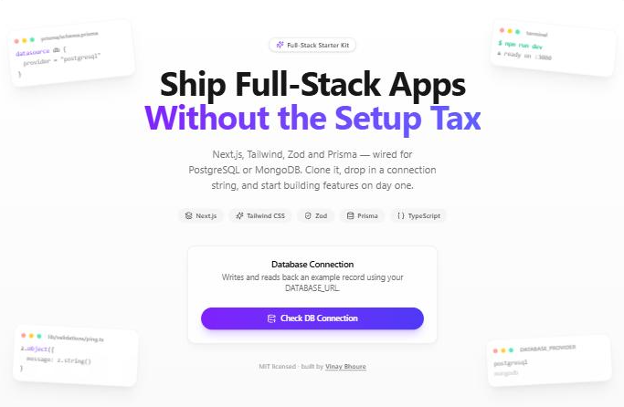

<div align="center">

# Full-Stack Starter Kit

**Next.js · Tailwind · shadcn/ui · Zod · Prisma — wired for PostgreSQL *or* MongoDB**

Clone it, drop in a connection string, and start building. No boilerplate to rewrite.




</div>

## Why this exists

Every new project starts the same way: wire up Next.js, Tailwind, a validation layer, an ORM, and
a database — before writing a single feature. This kit does that once, well, so cloning it is the
setup step.

## Stack

| Layer          | Choice                                                             |
| -------------- | ------------------------------------------------------------------- |
| Framework      | [Next.js 16](https://nextjs.org) (App Router, TypeScript) — frontend + backend in one app |
| Styling        | [Tailwind CSS v4](https://tailwindcss.com)                          |
| UI components  | shadcn-style primitives in `src/components/ui` (Button, Card, Badge, Input), ready for `npx shadcn add` |
| Validation     | [Zod](https://zod.dev)                                              |
| ORM            | [Prisma](https://www.prisma.io) — one schema per provider, switched by an env var |
| Database       | PostgreSQL ([Neon](https://neon.tech)) **or** MongoDB ([Atlas](https://www.mongodb.com/atlas)) — pick one |
| Notifications  | [sonner](https://sonner.emilkowal.ski) toasts + [lucide-react](https://lucide.dev) icons |
| Backend layer  | `src/server/{config,controllers,routers,middleware}` — API routes stay thin |

## Quick start

```bash
git clone https://github.com/vinayBhoure/starter-kit.git
cd starter-kit
npm install
```

`npm install` copies the right Prisma schema and runs `prisma generate` automatically — nothing
else to configure before the app boots.

```bash
npm run dev
```

Open [http://localhost:3000](http://localhost:3000). You'll land on the page above, with a
**Check DB Connection** button that toasts success or failure once `DATABASE_URL` is set (next
section) — until then, a failed check is expected.

## Database setup

This kit connects to **one database at a time**, chosen with `DATABASE_PROVIDER` in `.env`.

1. Copy the example env file:
   ```bash
   cp .env.example .env
   ```
2. Set your provider and connection string:
   ```bash
   DATABASE_PROVIDER=postgresql   # or: mongodb
   DATABASE_URL=...
   ```
3. Apply the schema and re-generate the client:
   ```bash
   npm run db:switch   # runs automatically on dev/build too
   npm run db:push
   ```
4. Click **Check DB Connection** — it writes and reads back an example `Ping` record and reports
   round-trip latency in a toast.

**Where to get `DATABASE_URL`:**

- **PostgreSQL (Neon):** dashboard → your project → **Connect** → **Prisma** tab
- **MongoDB (Atlas):** dashboard → your cluster → **Connect** → **Drivers**

Switching providers later is the same three steps — change the two `.env` values, re-run
`npm run db:switch && npm run db:push`. Two schema files exist (`schema.postgresql.prisma`,
`schema.mongodb.prisma`) so each can use the field types its provider needs, kept in sync as one
model.

## Project structure

```
prisma/
  schema.postgresql.prisma   # source schema — Postgres
  schema.mongodb.prisma      # source schema — MongoDB
  schema.prisma              # generated, do not edit directly
scripts/
  switch-db-provider.mjs     # copies the active schema + runs `prisma generate`
src/
  app/
    page.tsx                 # landing page
    api/health/route.ts      # DB connection check endpoint
  components/
    ui/                      # shared UI primitives (Button, Card, Badge, Input)
    db-check.tsx             # "Check DB Connection" button + toasts
  lib/
    db.ts                    # Prisma client singleton
    utils.ts                 # cn() helper
    validations/             # Zod schemas
  server/
    config/                  # env access
    controllers/             # business logic
    routers/                 # validate -> controller -> response
    middleware/               # Zod body-validation helper
```

## Adding your own features

1. Add a model to `prisma/schema.postgresql.prisma` and/or `prisma/schema.mongodb.prisma`, then
   `npm run db:switch && npm run db:push`.
2. Add a Zod schema in `src/lib/validations/`.
3. Add a controller in `src/server/controllers/`, a router in `src/server/routers/`, and a route
   file under `src/app/api/.../route.ts` — following the `health.*` pattern.
4. Need a new UI primitive? `npx shadcn add <component>` — `components.json` is already set up.

## License

MIT — see [LICENSE](LICENSE). Built by [Vinay Bhoure](https://vinaybhoure.xyz).
